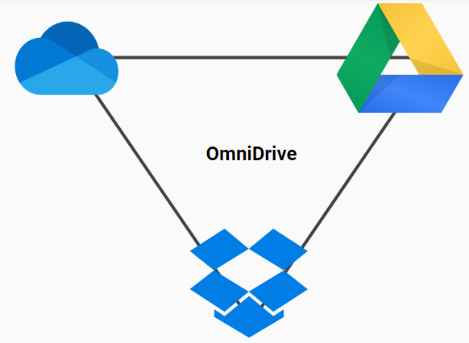

# OmniDrive Android Application

### Problem
Many people use multiple applications for cloud storage.
It can be a hassle to shuffle between different cloud storage applications.

### Solution
OmniDrive brings all your cloud storage to one place.

## Features
- Allows the user to register for an OmniDrive account and link their Google Drive, Dropbox, and/or OneDrive account(s)
- Tabbed format
- View list of files in each drive
- Preview files
- Query files
- Filter files
- Display metadata
- Download files to device
